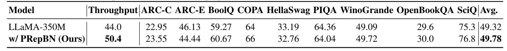

# SLAB

### **SLAB: Efficient Transformers with Simplified Linear Attention and Progressive Re-parameterized BatchNorm**

*Jialong Guo\*, Xinghao Chen\*, Yehui Tang, Yunhe Wang (\*Equal Contribution)*

*arXiv 2024* 

[[`arXiv`](https://arxiv.org/abs/xx)] [[`BibTeX`](#citation)]

## 🔥 Updates
* **2024/05/13**: Pre-trained models and codes of SLAB are released both in [Pytorch](https://github.com/xinghaochen/SLAB) and [Mindspore](https://github.com/mindspore-lab/models/tree/master/research/huawei-noah/SLAB).

## 📸 Overview
This is an official pytorch implementation of our paper "**SLAB: Efficient Transformers with Simplified Linear Attention and Progressive Re-parameterized BatchNorm**". In this paper, we investigate the computational bottleneck modules of efficient transformer, i.e., normalization layers and attention modules. Layer normalization is commonly used in transformer architectures but is not computational friendly due to statistic calculation during inference. However, replacing Layernorm with more efficient batch normalization in transformer often leads to inferior performance and collapse in training. To address this problem, we propose a novel method named PRepBN to progressively replace LayerNorm with re-parameterized BatchNorm in training. During inference, the proposed PRepBN could be simply re-parameterized into a normal BatchNorm, thus could be fused with linear layers to reduce the latency. Moreover, we propose a simplified linear attention (SLA) module that is simply yet effective to achieve strong performance. Extensive experiments on image classification as well as object detection demonstrate the effectiveness of our proposed method. For example, powered by the proposed methods, our SLAB-Swin obtains 
83.6% top-1 accuracy on ImageNet with 16.2ms latency, which is 2.4ms less than that of Flatten-Swin with 0.1 higher accuracy.

<p align="center">
     <br />
 <em> 
    Figure 1: The framework of our proposed Progressive Re-parameterized BatchNorm.
    </em>
</p>

<p align="center">
     <br />
 <em> 
    Figure 2: Visualization of attention map for different methods.
    </em>
</p>

<p align="center">
     <br />
 <em> 
    Figure 3: Results of our method for classification and detection.
    </em>
</p>

<p align="center">
     <br />
 <em> 
    Figure 4: Results of our method for LLaMA-350M on various benchmarks.
    </em>
</p>

## 1️⃣ Image Classification

### Dependenices
```shell
- torch
- torchvision
- numpy
- einops
- timm==0.4.12
- opencv-python==4.4.0.46
- termcolor==1.1.0
- yacs==0.1.8
- apex
```

### Training

Train models from scratch using the following command:
```shell
python -m torch.distributed.launch --nproc_per_node=8 main.py --cfg <config-path> --data-path <imagenet-path> --output <output-path>
```

### Evaluation

Merge PRepBN for Swin Transformer:

```shell
python -m torch.distributed.launch --nproc_per_node=1 eval.py --cfg <config-path> --batch-size 128 --data-path <imagenet-path>  --pretrained <pretrained-path>
```
### Checkpoints

TBD

## 2️⃣ Object Detection

### Installation

```shell
pip install torch 
pip install torchvision

pip install timm==0.4.12
pip install einops
pip install opencv-python==4.4.0.46 termcolor==1.1.0 yacs==0.1.8
pip install -U openmim
pip install mmcv-full==1.4.0
pip install mmdet==2.11.0
```
Install apex

### Training

SLAB-Swin-T
```shell
python -m torch.distributed.launch --nproc_per_node 8 --nnodes <world_size> --node_rank <rank> train.py configs/swin/mask_rcnn_swin_linear_tiny_patch4_window7_mstrain_480-800_adamw_1x_coco.py --work-dir <output_path> --launcher pytorch --init_method <init_method> --cfg-options model.pretrained=<pretrained_backbone_path>
```

SLAB-Swin-S
```shell
python -m torch.distributed.launch --nproc_per_node 8 --nnodes <world_size> --node_rank <rank> train.py configs/swin/mask_rcnn_swin_linear_small_patch4_window7_mstrain_480-800_adamw_1x_coco.py --work-dir <output_path> --launcher pytorch --init_method <init_method> --cfg-options model.pretrained=<pretrained_backbone_path>
```

Swin-T-RepBN
```shell
python -m torch.distributed.launch --nproc_per_node 8 --nnodes <world_size> --node_rank <rank> train.py configs/swin/mask_rcnn_swin_tiny_patch4_window7_mstrain_480-800_adamw_1x_coco.py --work-dir <output_path> --launcher pytorch --init_method <init_method> --cfg-options model.pretrained=<pretrained_backbone_path>
```

Swin-S-RepBN
```shell
python -m torch.distributed.launch --nproc_per_node 8 --nnodes <world_size> --node_rank <rank> train.py configs/swin/mask_rcnn_swin_small_patch4_window7_mstrain_480-800_adamw_1x_coco.py --work-dir <output_path> --launcher pytorch --init_method <init_method> --cfg-options model.pretrained=<pretrained_backbone_path>
```

PVT-T-RepBN
```shell
python -m torch.distributed.launch --nproc_per_node 8 --nnodes <world_size> --node_rank <rank> train.py configs/pvt/mask_rcnn_pvt_t_fpn_1x_coco.py --work-dir <output_path> --launcher pytorch --init_method <init_method> --cfg-options model.pretrained=<pretrained_backbone_path>
```

PVT-S-RepBN
```shell
python -m torch.distributed.launch --nproc_per_node 8 --nnodes <world_size> --node_rank <rank> train.py configs/pvt/mask_rcnn_pvt_s_fpn_1x_coco.py --work-dir <output_path> --launcher pytorch --init_method <init_method> --cfg-options model.pretrained=<pretrained_backbone_path>
```

### Checkpoints

| Model | AP | config | checkpoints |
| :---: | :---: | :---: | :---: | 


## 3️⃣ Language Task

### Dependencies
```shell
- torch==1.13.1
- tensorboardX
- numpy
- rouge_score
- fire
- openai==0.27.6
- transformers==4.29.1
- datasets==2.17.0
- sentencepiece
- tokenizers==0.13.3
- deepspeed==0.8.3
- accelerate==0.27.2
- scikit-learn
```

### Evaluation

```shell
python evaluation.py --ckpt <checkpoint-path>
```


## ✏️ Reference
If you find SLAB useful in your research or applications, please consider giving a star ⭐ and citing using the following BibTeX:
```
@article{guo2024slab,
  title={SLAB: Efficient Transformers with Simplified Linear Attention and Progressive Re-parameterized BatchNorm},
  author={Guo, Jialong and Chen, Xinghao and Tang, Yehui  and Wang, Yunhe},
  journal={arXiv preprint},
  year={2024}
}
```
